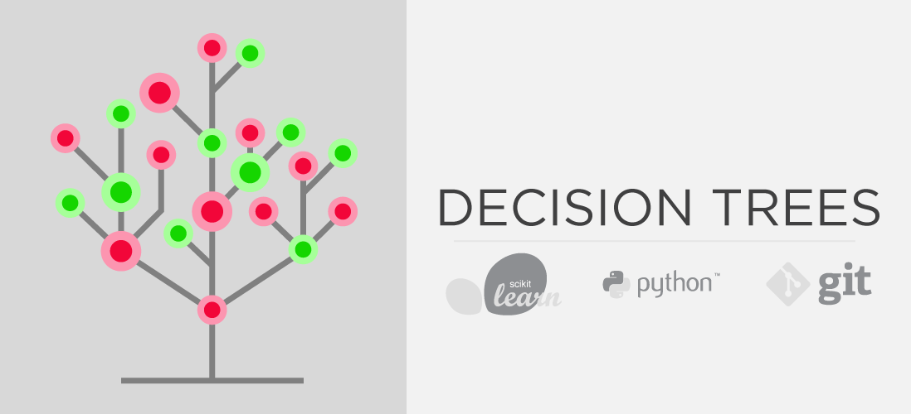

# Deep Dive | Decision Trees

Decision trees are a supervised learning algorithm used for classification and regression.This post will dive deep into the workings of a decision tree. Along the way, I will walk through a detailed example and showcase some necessary skills required to tune and improve any machine learning algorithm. The post will also exhibit some exploratory data analysis and visualization practices that can help better understand the data.

Table of Contents
* Decision Trees  
  * How do they work?  
  * How do we quantitatively evaluate how good a split is?  
    * Option 1) FOR CLASSIFICATION - Entropy or Information gain
    * Option 2) FOR CLASSIFICATION - Gini Impurity  
    * Option 3) FOR REGRESSION - Mean squared error  
  * Hyperparameters  
    * criterion  
    * max_depth  
    * min_samples_split  
    * min_samples_leaf  
  * What kind of data do you pass to Decision Trees?  
    * Categorical vs Numerical   
    * Missing Values  
* Example Model   
  * Importing Libraries  
  * Importing the data  
  * Feature Dictionary  
    - Independent Variables
    * Response Variable  
  * Data Wrangling and Exploratory Data Analysis   
    - Data Summary  
  * Data Insights  
  * Base Model  
    * Training the Base model  
    * Base model results  
    * Visualizing the base model  
  * Feature Engineering  
    * Extended Feature Dictionary  
    * Feature Engineering Data Insights  
  * Hyperparameter Optimization  
    * Validaion Set  
    * Cross Validation  
    * GridSearchCV  
    * RandomSearchCV  
  * Final Model  
